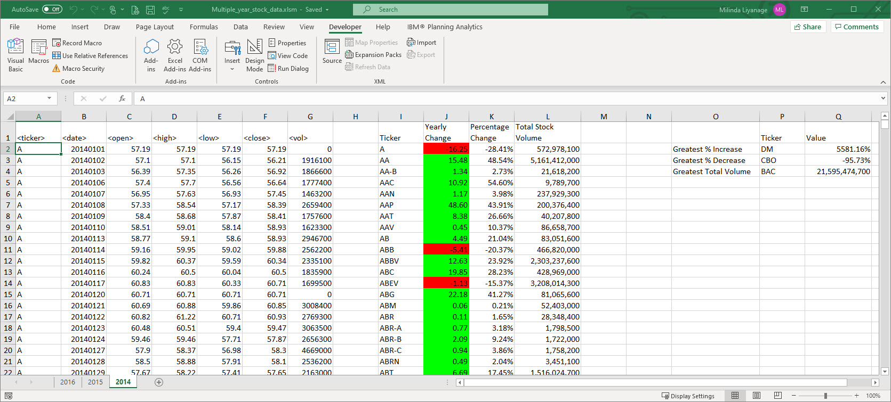
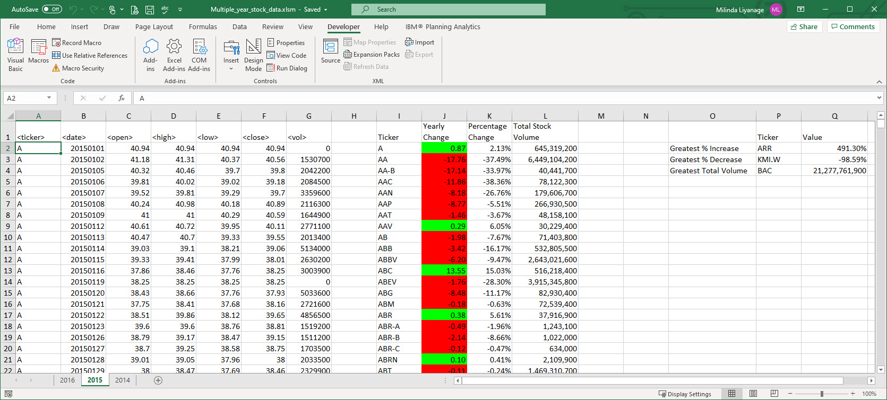
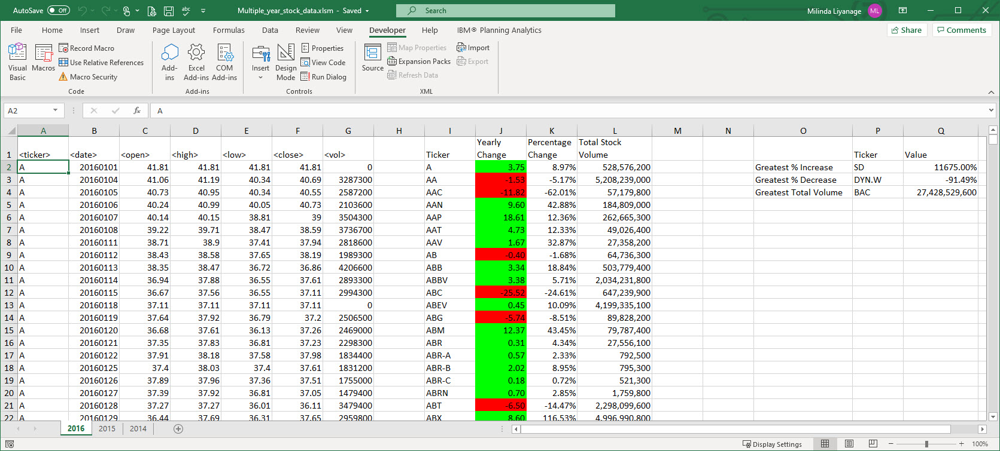

# VBA-challenge

VBA Assignment - Milinda 'ML' Liyanage

## Instructions to run the Stock market analyst

* Copy the provided #ddd [VB Code](Resoures/StockAnalysis.bas) file to same folder where the data workbook is located

* Open the data workbook [Stock Raw Data](Resources/Multiple_year_stock_data_Raw.xlsx) 

* Open the Visual Basic window available from Developer ribbon

* From VB window Import the [VB Code](StockAnalysis.bas)

* Open StockAnalysis Module

* Run PopAllSheets() function. 
	This function will create a Summary table and the Analysis data and format data in each workbook.
	At the end the it will will display the first sheet. 
	
* If you want clear the data and rerun use ClearAllSheet() function and rerun the data creation function

* Finally Save the workbook as Excel Macro-Enabled Workbook (*.xlsm)  
	
### Files

* [Test Data](Resources/alphabetical_testing.xlsx) - Use this while developing your scripts.

* [Stock Raw Data](Resources/Multiple_year_stock_data_Raw.xlsx) - Run your scripts on this data to generate the final homework report.

* [VB Code](Resoures/StockAnalysis.bas) - VB code to copy in to the A

* [Updated Stock Data](Resources/Multiple_year_stock_data_Updated.xlsx) - Updated data, where you you rerun the update using the defined Buttons

	
* The result will look as follows.

Year 2014

Year 2015

Year 2016

